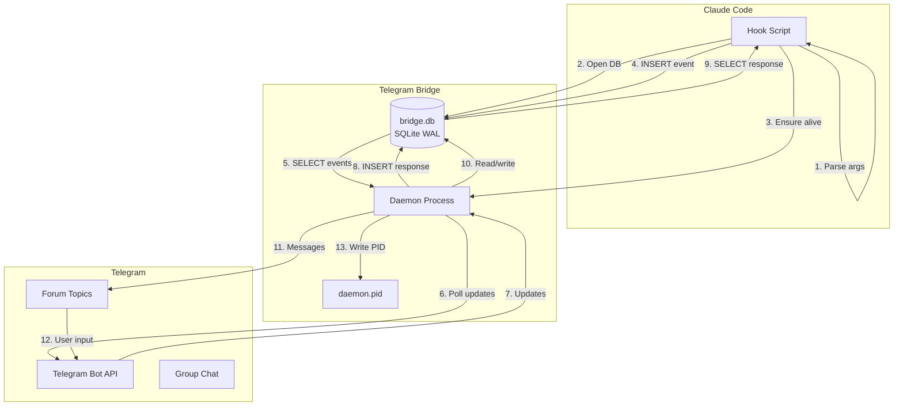

# Architecture Documentation

## Overview

**afk-claude-telegram-bridge** is a remote-control system that enables controlling Claude Code from Telegram when away from keyboard (AFK). It consists of two main components:

1. **Hook** - Runs as a Claude Code hook, intercepts tool calls and sends permission requests to Telegram
2. **Daemon** - Long-running process that polls Telegram for responses and forwards them back to the hook

The system uses **SQLite** (`bridge.db` via `better-sqlite3` in WAL mode) for IPC between hook and daemon, with Telegram as the user interface.

## Functional Areas

### `src/hook/`
Claude Code hook implementation. Entry point for all hook events.

- **index.ts** - Main hook orchestrator: parses args, resolves session, dispatches to handlers
- **args.ts** - Parses CLI arguments and stdin JSON from Claude Code
- **permission.ts** - Handles permission request events, sends to daemon via SQLite
- **stop.ts** - Handles stop events, polls SQLite for instructions

### `src/bridge/`
Telegram bridge daemon. Long-running process that manages Telegram communication.

- **daemon.ts** - Main daemon loop: polls Telegram, processes updates, manages slots and state
- Handles permission batching, trust system, and queued instructions

### `src/services/`
Shared services used by both hook and daemon.

| Service | Purpose |
|---------|---------|
| **db.ts** | SQLite connection management: openDatabase, getDatabase, schema versioning |
| **db-queries.ts** | Typed query helpers for all tables (sessions, events, responses, batches, etc.) |
| **ipc-sqlite.ts** | SQLite-backed IPC: writeEvent, readResponse, readAllUnprocessedEvents |
| **telegram.ts** | Telegram Bot API wrapper: sendMessage, answerCallbackQuery, etc. |
| **telegram-poller.ts** | Long-polling for Telegram updates |
| **state-persistence-sqlite.ts** | Reconstruct State from SQLite sessions + pending_stops tables |
| **session-binding-sqlite.ts** | Bind Claude Code session_id to AFK sessions via SQLite |
| **daemon-health.ts** | Monitor daemon health via daemon.pid + heartbeat, auto-restart if needed |
| **daemon-launcher.ts** | Spawn daemon process |

### `src/core/`
Core domain logic.

- **state/** - Pure state transitions: addSlot, removeSlot, heartbeatSlot, etc.
- **config/** - Configuration loading and validation

### `src/types/`
TypeScript type definitions and error types.

- **config.ts** - Config interface
- **state.ts** - State, Slot, PendingStop types
- **events.ts** - IpcEvent, StopEvent types
- **errors.ts** - Error constructors (HookError, BridgeError, etc.)
- **db.ts** - Database error types (ConnectionError, QueryError, ConstraintError)

### `src/cli/`
CLI entry points for activate/deactivate commands.

---

## SQLite Schema

`bridge.db` uses WAL journal mode with `busy_timeout = 5000` and `foreign_keys = ON`.

| Table | Purpose |
|-------|---------|
| **sessions** | Active AFK sessions (slot_num, claude_session_id binding, thread_id, trust) |
| **events** | IPC event queue (hook writes, daemon reads and marks processed) |
| **responses** | IPC response queue (daemon writes, hook reads and marks read) |
| **permission_batches** | Buffered permission requests for batched Telegram messages |
| **permission_batch_items** | Links batch → individual events |
| **pending_stops** | Stop events awaiting Telegram instruction delivery |
| **known_topics** | Telegram forum topics created (for cleanup on reset) |

---

## Key Execution Flows

### 1. Permission Request Flow (Hook → SQLite → Daemon → Telegram)

```
runHook
  → parseHookArgs           # Parse CLI/stdin
  → loadConfig              # Load bot token, group ID
  → openDatabase            # Open bridge.db
  → resolveSession          # Find bound session via SQLite
  → ensureDaemonAlive       # Start daemon if needed
  → handlePermissionRequest
    → writeEvent            # INSERT into events table
    → pollForResponse       # SELECT from responses table (poll loop)
    → return permission decision to Claude Code
```

### 2. Stop/Instruction Flow (Claude Stop → SQLite → Telegram)

```
handleStop
  → handleStopRequest
    → writeEvent            # INSERT Stop event into events table
    → pollForInstruction    # SELECT from responses table (poll loop)
      → check kill/force_clear signal files
      → check daemon health periodically
      → send KeepAlive events
    → return instruction to Claude Code (blocks stop)
```

### 3. Daemon Telegram Poll Loop

```
runDaemonIteration
  → readAllUnprocessedEvents  # SELECT unprocessed events from SQLite
  → processEventSideEffects
    → Permission batching (INSERT into permission_batches)
    → Auto-approve for trusted sessions
    → Stop → send Telegram message, INSERT into pending_stops
  → pollAndRouteUpdates
    → pollTelegram            # Long-poll Telegram
    → processIncomingMessage  # Messages → writeResponse to SQLite
    → handleCallbackQuery     # Button clicks → writeResponse to SQLite
```

### 4. Session Binding Flow

```
resolveSession
  → loadState               # Reconstruct from SQLite sessions table
  → findBoundSession        # SELECT WHERE claude_session_id = ?
  → findUnboundSession      # SELECT WHERE claude_session_id IS NULL
  → bindSession             # UPDATE sessions SET claude_session_id = ?
```

---

## System Architecture Diagram



### Data Flow Summary

| Step | Component | Action |
|------|-----------|--------|
| 1 | Hook | Claude Code triggers hook (PreToolUse, Stop, etc.) |
| 2 | Hook | Parse arguments, load config, open SQLite |
| 3 | Hook | Resolve session via SQLite binding |
| 4 | Hook | Ensure daemon is running (start if not) |
| 5 | Hook | INSERT event into events table |
| 6 | Daemon | SELECT unprocessed events, process permission/stop |
| 7 | Daemon | Polls Telegram for user responses |
| 8 | Telegram | User approves/denies or sends instruction |
| 9 | Daemon | INSERT response into responses table |
| 10 | Hook | SELECT response, return to Claude Code |

### Key Design Decisions

1. **SQLite IPC** - Uses `better-sqlite3` in WAL mode for atomic, concurrent hook↔daemon communication
2. **Daemon PID file** - `daemon.pid` for daemon lifecycle management (not stored in SQLite)
3. **Permission batching** - Multiple permissions buffered and sent as single Telegram message
4. **Session trust** - After N approvals, session becomes "trusted" (auto-approve)
5. **Forum topics** - Each slot gets its own Telegram forum topic for isolation
6. **Slot-based multi-session** - Single daemon manages multiple concurrent Claude sessions
7. **In-memory queued instructions** - Messages arriving before Stop events are held in daemon runtime memory (not persisted — if daemon restarts, the Stop event also disappears so there's nothing to deliver to)
